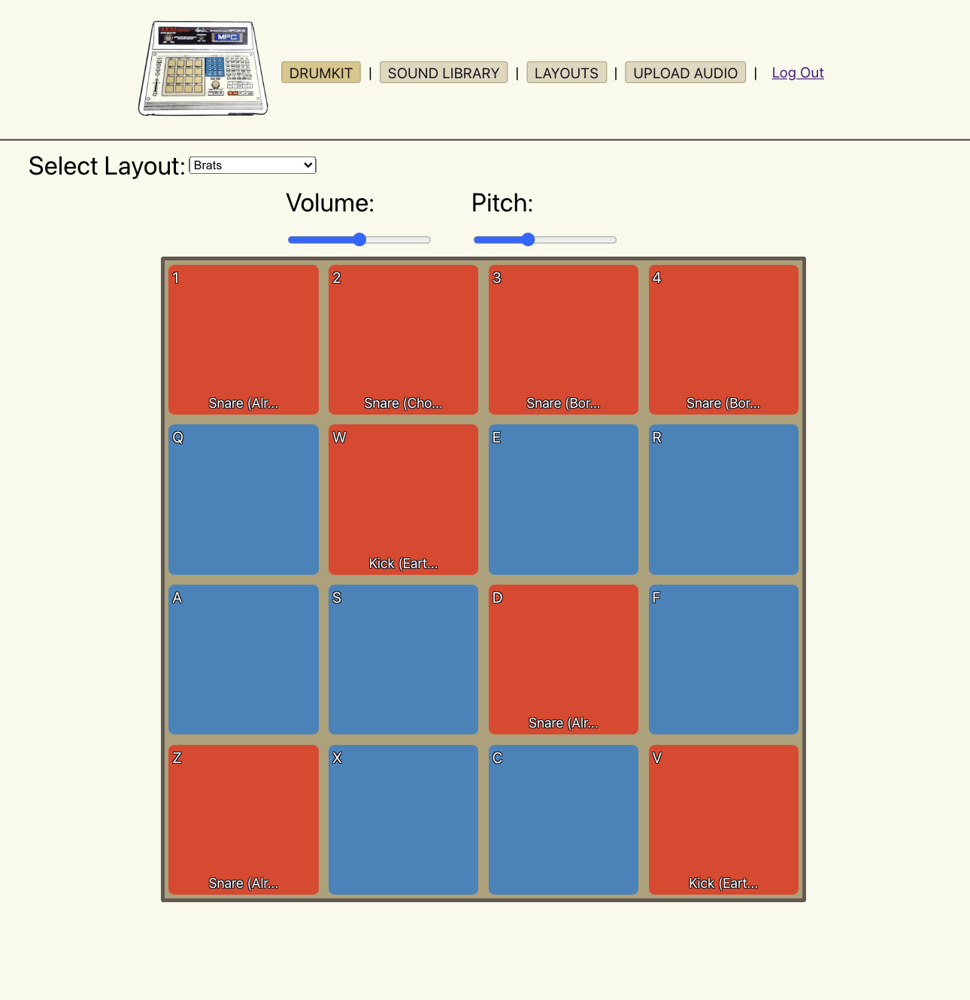

  

Shortcut To [DEMO](https://mpc-maps-f12fcab484eb.herokuapp.com/)

##### Benjamin Cohn

  

## :pencil: Description

Introducing the ultimate digital destination for all MPC enthusiasts and sound creators: your one-stop virtual MPC workshop. Inspired by the legendary Akai MPC, renowned for revolutionizing music production with its integrated sampler and sequencer, our platform brings the essence of MPC's tactile beat-making experience into the digital realm.

Dive into our expansive Sound Library, where you'll find an eclectic array of samples ready to infuse your tracks with the signature warmth and grit that MPCs are celebrated for. From vintage drum sounds to contemporary sonic textures, our meticulously curated collection is designed to cater to every genre and production style.

With our intuitive Drumkit Builder, you can channel the MPC's spirit by crafting custom drum kits tailored to your unique sound. Select from our diverse sound map, and assign samples to your virtual pads, creating personalized kits that resonate with your musical identity.

Explore our Private Layouts Collection, a feature that pays homage to the MPC's layout flexibility, enabling producers to configure their workflow according to their preferences. Access a library of custom templates or create your own, optimizing your beat-making process for efficiency and creativity.

Leverage our streamlined Upload Feature, a nod to the MPC's sampling prowess, allowing you to effortlessly move sound samples to our database. Whether it's field recordings, synthesized sounds, or vintage vinyl chops, our platform simplifies the process, enabling you to expand your sonic palette with ease.

Our platform embodies the innovation and versatility of Akai MPCs, reimagined for today's digital landscape. Whether you're a seasoned beat-maker or new to the world of music production, join us in celebrating the legacy of MPCs while pushing the boundaries of what's possible in sound creation.

NOTE FOR EDIT: Client-side latency solution

 :gear: Functionality

| Description | Screenshot |
|------------ | ------------|
| <h3 align="center">"The Drumkit" Page</h3> |  width="700"/> |
| <h3 align="center">"Add Albums" Page</h3> | " width="700"/> |

## :computer: Technologies Used

<h2> :atom_symbol: Getting Started </h2>

<h3> :calling: Instructions </h3>

Where to Begin

<ol>
<li>After browsing to the app, easily sign up to start browsing the sounds collection</li>
<li>If you are already a member, sign to continue building drumkit layouts or add new samples to the sound library</li>
</ol>

How to Add A New Layout

<ol>
<li>Navigate to the "Layouts" page to access the search bar</li>
<li>Search for your favorite album titles or musical artists</li>
<li>When you find what you are looking for, click the "Add To Collection" button to be redirected to your updated collection list</li>
</ol>

Sounds Library

<ol>
<li>The entire audio library for the app is share amongst all users.</li>
<li>You can either browse the library, or add new sounds using the multi-featured upload page.</li>
  </ol>

Trello Board
   
<a href="https://trello.com/b/xjUlvP6I/mpc-maps">https://trello.com/b/xjUlvP6I/mpc-maps</a>

   

Deployed Link

<a href="https://mpc-maps-f12fcab484eb.herokuapp.com">MPC MAPS</a>

## :fast_forward: Next Steps   

### Upcoming Features

- [ ] Ability to add and delete categories with automatic category detection when uploading files

- [ ] Allow users to edit and make layouts shareable

- [ ] Added features to the drumkit including: custom pad colors, sound hotswap, and pitch control per-pad